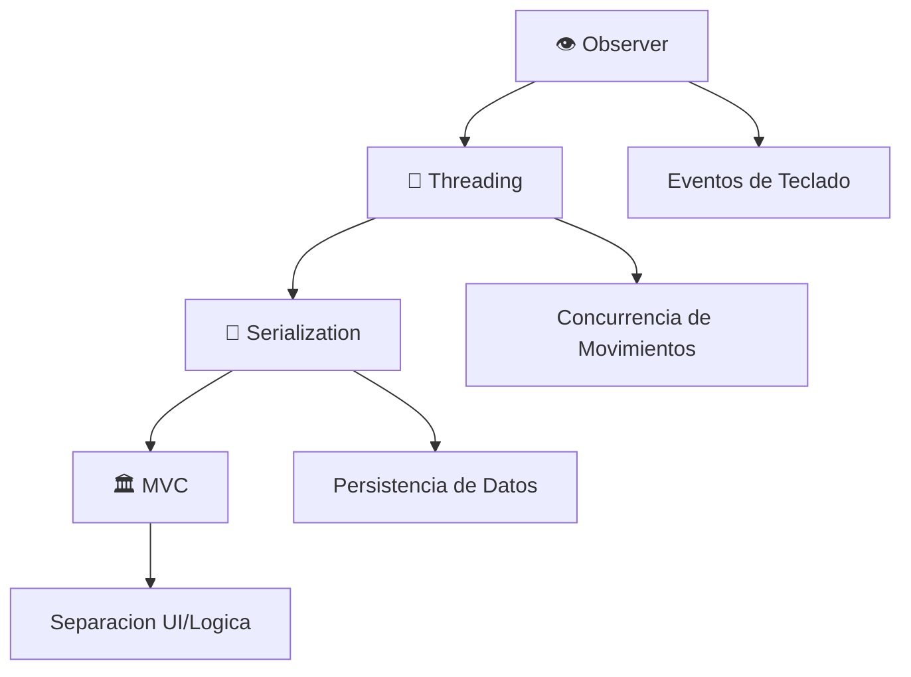

<div align="center">

# 🚀 Space Invaders

[](https://www.java.com)
[](https://docs.oracle.com/javase/tutorial/uiswing/)
[](https://github.com)


**🎯 Un juego clasico arcade con tecnologia moderna**


</div>

---

## 🌟 **Descripcion del Proyecto**

> **Space Invaders** es una recreacion moderna del clasico juego arcade, desarrollado completamente en Java.  
> Combina la nostalgia retro con funcionalidades avanzadas como sistema de guardado, puntuaciones persistentes y efectos visuales impresionantes.

<details>
<summary>🎮 <strong>¿Por que Space Invaders?</strong></summary>

- **Clasico atemporal**: Un juego que ha marcado generaciones
- **Aprendizaje completo**: Implementa conceptos avanzados de programacion
- **Diversión garantizada**: Gameplay adictivo y desafiante
- **Tecnologia moderna**: Usando las mejores practicas de Java

</details>

---

## ⭐ **Caracteristicas Principales**

<table>
<tr>
<td>

### 🎮 **Gameplay Core**

- 🚁 **Movimiento fluido** con teclas de flecha
- 💥 **Sistema de disparo** con barra espaciadora
- ⏱️ **Tiempo limitado**: 90 segundos de intensidad
- 💀 **Collision detection** precisa y responsive

</td>
<td>

### 👾 **Sistema de Enemigos**

- 🟢 **Tipo 1**: 2 hits, 10 pts
- 🟡 **Tipo 2**: 3 hits, 20 pts  
- 🔴 **Tipo 3**: 4 hits, 30 pts
- 🎯 **Movimiento inteligente** y patrones dinamicos

</td>
</tr>
<tr>
<td>

### 🎁 **Power-ups & Items**

- ⏰ **Time Boost**: +10 segundos
- 🪙 **Bonus Points**: +10 puntos
- 💀 **Time Penalty**: -10 segundos
- ⚠️ **Score Penalty**: -10 puntos

</td>
<td>

### 🔧 **Funciones Avanzadas**

- 💾 **Save/Load System**
- 🏆 **Top 5 Leaderboard**
- ✨ **Efectos visuales HD**
- 🎵 **Interfaz animada**

</td>
</tr>
</table>

---

## 🎯 **Como Jugar**

<div align="center">

### 🕹️ **Controles**

| 🎮 **Control** | ⚡ **Accion** | 🔥 **Efecto** |
|:-------------:|:-------------:|:-------------:|
| ⬆️ **↑** | Mover arriba | Navegacion vertical |
| ⬇️ **↓** | Mover abajo | Control preciso |
| 🎯 **SPACE** | Disparar | Proyectiles laser |
| 🔙 **ESC** | Menu principal | Salida rapida |
| 💾 **S** | Guardar partida | Persistencia |

</div>

### 🏆 **Sistema de Puntuacion**

```
🟢 Enemigo Facil    →  10 puntos
🟡 Enemigo Medio    →  20 puntos  
🔴 Enemigo Dificil  →  30 puntos
🪙 Bonus Moneda     →  +10 puntos
⚠️ Penalizacion     →  -10 puntos
```

---

## 🏗️ **Arquitectura del Proyecto**

<div align="center">

### 📊 **Stack Tecnologico**


</div>

### 📁 **Estructura de Archivos**

```
🎮 IPC1_P2_VJ2024/
├── 📂 src/                     # 💻 Codigo fuente
│   ├── 🚀 Main.java           # 🎯 Punto de entrada
│   ├── 🏠 InterfazInicio.java # 🎨 Menu principal
│   ├── 🎮 Juego.java          # 🎯 Motor del juego
│   ├── 🚁 PlayerNave.java     # 🕹️ Control del jugador
│   ├── 👾 Enemigos.java       # 🤖 Sistema de enemigos
│   ├── 🎁 Item.java           # ✨ Items coleccionables
│   ├── 🔧 ControlItems.java   # 🎲 Generador de items
│   ├── 💀 GameOver.java       # 🏁 Pantalla final
│   ├── 📂 CargarJuego.java    # 💾 Carga de partidas
│   ├── 🏆 top5.java           # 📊 Tabla de puntuaciones
│   ├── 📈 ControlScores.java  # 💯 Gestor de scores
│   └── 💾 StatusGame.java     # 🔄 Estado del juego
├── 📁 bin/                     # ⚙️ Archivos compilados
├── 🖼️ imgs/                    # 🎨 Recursos graficos
└── 📖 README.md               # 📚 Documentacion
```

### 🎯 **Componentes Principales**

<details>
<summary>🚀 <strong>Main.java</strong> - Punto de Entrada</summary>

- Inicializa la aplicacion en el EDT (Event Dispatch Thread)
- Configura el entorno de ejecucion
- Maneja la configuracion inicial del sistema

</details>

<details>
<summary>🏠 <strong>InterfazInicio.java</strong> - Menu Principal</summary>

**Funcionalidades:**

- 🆕 Nuevo juego
- 📂 Cargar partida guardada  
- 🏆 Ver top 5 puntuaciones
- 🚪 Salir del juego

</details>

<details>
<summary>🎮 <strong>Juego.java</strong> - Motor Principal</summary>

**Responsabilidades:**

- 🔄 Game loop principal
- ⏱️ Sistema de tiempo
- 🎯 Gestion de puntuacion
- 💾 Persistencia de datos
- 🔗 Coordinacion de componentes

</details>

<details>
<summary>🚁 <strong>PlayerNave.java</strong> - Control del Jugador</summary>

**Capacidades:**

- ⬆️⬇️ Movimiento vertical suave
- 💥 Sistema de disparo
- 💥 Deteccion de colisiones
- 🚀 Gestion de proyectiles

</details>

<details>
<summary>👾 <strong>Enemigos.java</strong> - Sistema de Enemigos</summary>

**Caracteristicas:**

- 🔄 Patrones de movimiento dinamicos
- 🎯 Diferentes tipos y resistencias
- 📊 Sistema de puntuacion variable
- 🤖 IA basica de comportamiento

</details>

<details>
<summary>🎁 <strong>ControlItems.java</strong> - Generador de Items</summary>

**Funciones:**

- 🎲 Aparicion aleatoria cada 6s
- 🔀 Tipos aleatorios de power-ups
- ➡️ Movimiento horizontal fluido
- ✨ Efectos visuales

</details>

---

## ⚙️ **Instalacion y Ejecucion**

### 📋 **Prerequisitos**

| Requisito | Version | Estado |
|-----------|---------|--------|
| ☕ **Java JDK** | 8+ | ✅ Requerido |
| 💻 **OS** | Windows/Linux/macOS | ✅ Compatible |
| 🖥️ **GUI Support** | Swing/AWT | ✅ Incluido |

### 🚀 **Pasos de Instalacion**

#### **Metodo 1: Compilacion Manual**

```bash
# 1️⃣ Clonar/Descargar el proyecto
cd IPC1_P2_VJ2024

# 2️⃣ Compilar el codigo fuente
javac -d bin src/*.java

# 3️⃣ Ejecutar el juego
java -cp bin Main
```

#### **Metodo 2: VS Code (Recomendado)**

1. 📂 **Abrir proyecto** en VS Code
2. 🔧 **Instalar extension** "Extension Pack for Java"
3. ▶️ **Ejecutar** con `F5` o `Ctrl+F5`
4. 🎮 **¡A jugar!**

### 📁 **Archivos Generados**

<table>
<tr>
<td align="center">

#### 🏆 **scores.txt**

```
Jugador,Puntos
IPC1,1320
Marcos,1140
Baten,1100
```

</td>
<td align="center">

#### 💾 **Juegos/*.bin**

```
14_05_20_06_2024.bin
16_30_20_06_2024.bin
```

*Formato: HH_mm_dd_MM_yyyy*

</td>
</tr>
</table>

---

## 🛠️ **Stack Tecnologico**

<div align="center">

### 🔧 **Tecnologias Core**

| Tecnologia | Uso | Nivel |
|:----------:|:---:|:-----:|
| ☕ **Java** | Lenguaje principal | 🌟🌟🌟🌟🌟 |
| 🖼️ **Swing** | GUI Framework | 🌟🌟🌟🌟⭐ |
| 🎨 **AWT** | Eventos y graficos | 🌟🌟🌟⭐⭐ |
| 🔀 **Threading** | Concurrencia | 🌟🌟🌟🌟⭐ |
| 💾 **Serialization** | Persistencia | 🌟🌟🌟⭐⭐ |

</div>

### 🏗️ **Patrones de Diseno**

<div align="center">



</div>

### ⚡ **Caracteristicas Tecnicas Avanzadas**

<details>
<summary>🔀 <strong>Sistema de Concurrencia</strong></summary>

- **🖥️ UI Thread**: Renderizado y eventos de interfaz
- **⏱️ Timer Thread**: Control de tiempo de juego
- **👾 Enemy Thread**: Movimiento de enemigos
- **🚁 Player Thread**: Control de nave y disparos
- **🎁 Items Thread**: Generacion y movimiento de items
- **🔒 Sincronizacion**: Evita race conditions

</details>

<details>
<summary>💾 <strong>Gestion de Memoria</strong></summary>

- **♻️ Garbage Collection**: Limpieza automatica
- **🎯 Resource Management**: Gestion de imagenes y sprites
- **⚡ Performance**: Optimizacion de rendering
- **🧹 Cleanup**: Eliminacion de objetos no utilizados

</details>

<details>
<summary>💿 <strong>Sistema de Persistencia</strong></summary>

- **📦 Object Serialization**: Estado completo del juego
- **📁 File I/O**: Lectura/escritura de puntuaciones
- **⚠️ Exception Handling**: Manejo robusto de errores
- **🔄 State Management**: Restauracion de partidas

</details>

---

## 🎓 **Objetivos Academicos Alcanzados**

<div align="center">

### 📚 **Competencias Desarrolladas**


</div>

<table>
<tr>
<td align="center">

### 🏗️ **Arquitectura**

- ✅ Diseno modular
- ✅ Separacion de responsabilidades  
- ✅ Patrones de diseno
- ✅ Codigo mantenible

</td>
<td align="center">

### 🔄 **Concurrencia**

- ✅ Multithreading
- ✅ Sincronizacion
- ✅ Performance optimization
- ✅ Race condition handling

</td>
</tr>
<tr>
<td align="center">

### 🎨 **Interfaz Grafica**

- ✅ Swing components
- ✅ Event handling
- ✅ Animations & GIFs
- ✅ User experience

</td>
<td align="center">

### 💾 **Persistencia**

- ✅ File I/O operations
- ✅ Object serialization
- ✅ Data management
- ✅ Error handling

</td>
</tr>
</table>

</div>
